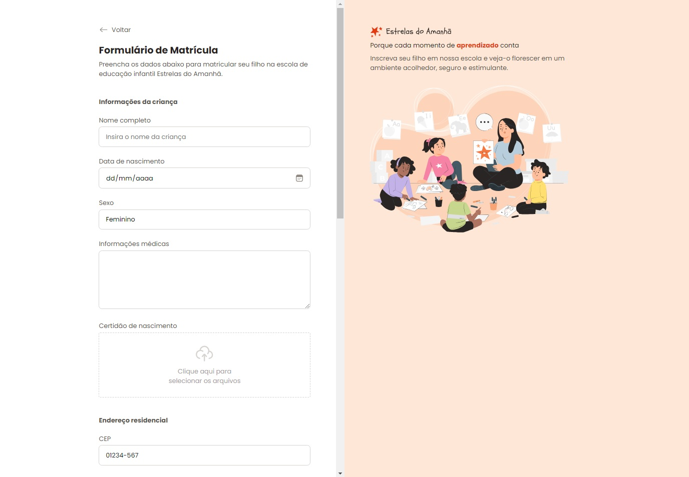

<h1 align="center"> Formulário de Matrícula </h1>

Projeto desenvolvido a partir do curso Fullstack da <a href="https://www.rocketseat.com.br/" target="_blank">Rocketseat</a> 

  <a href="#-tecnologias">Tecnologias</a>&nbsp;&nbsp;&nbsp;|&nbsp;&nbsp;&nbsp;
  <a href="#-projeto">Projeto</a>&nbsp;&nbsp;&nbsp;|&nbsp;&nbsp;&nbsp;
  <a href="#-layout">Layout</a>&nbsp;&nbsp;&nbsp;|&nbsp;&nbsp;&nbsp;
  <a href="#memo-licença">Licença</a>

  

 

  

## 🚀 Tecnologias

Esse projeto foi desenvolvido com as seguintes tecnologias:

- HTML e CSS
- Grid e Flexbox
- Git e Github
- Figma

## 💻 Projeto

Neste projeto de formulário de matrícula, foram exploradas a criação de formulários em HTML, abordando campos de entrada de texto, data, seleção, text area e envio de arquivos. Foram criados inputs customizados como radio e checkbox e campo de drop para arquivos anexo.

## 🔖 Layout

Você pode visualizar o layout do projeto através [Desse link](https://www.figma.com/community/file/1365016793556649696). É necessário ter conta no [Figma](https://figma.com) para acessá-lo.

## :memo: Licença

Esse projeto está sob a licença MIT.

---

♥
